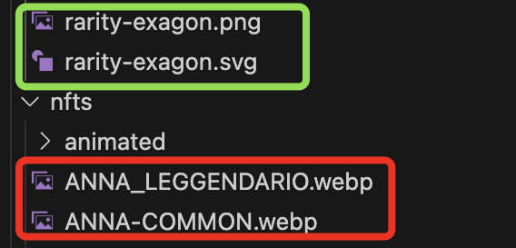

# Denomination conventions

(camelCase, kebab-case, PascalCase, UPPERCASE, lowercase SEE NOTES): Remember that each element and file has its own naming conventions. JavaScript variables are written in camelCase, while the names of component and page folders use PascalCase. (**EXCEPTION**: pages must end with "Page," so Home becomes HomePage). On the other hand, images use kebab-case (both folder names and content). **In any case, there should be NO spaces.**

