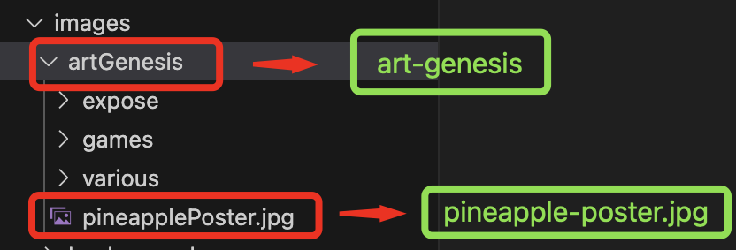
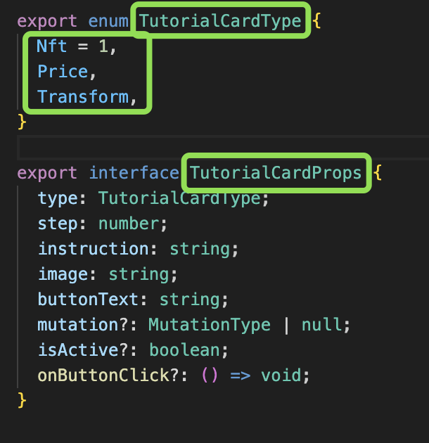
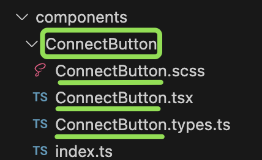

# List of examples

_**no spaces allowed**_

## camelCase

> helloWorld

applies to anything **js-related**: variables, props, useState, useEffect.

_variables, useState, useRef_

_props_

## kebab-case

> hello-world

applies to **file names of images, fonts, subfolders, and content**.

_images, fonts_

## PascalCase

> HelloWorld

applies to **enum, interfaces, folder names "pages" and "components" + contents of each individual file (excluding index.ts)**.

_enum e contenuto, interface_

_pages_

_components_
