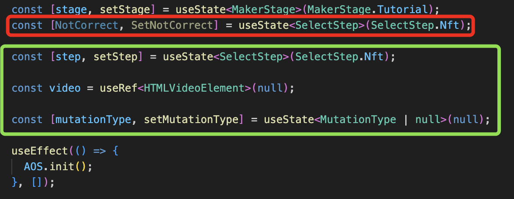
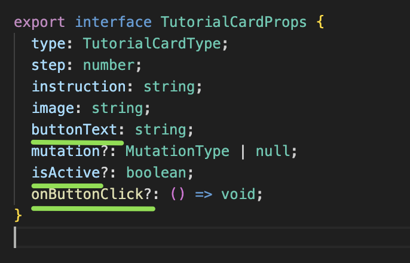
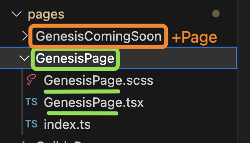

# List of examples

_**no spaces allowed**_

## camelCase 
> helloWorld

applies to anything **js-related**: variables, props, useState, useEffect.

*variables, useState, useRef*

*props*

## kebab-case
> hello-world

applies to **file names of images, fonts, subfolders, and content**.

*images, fonts*

## PascalCase
> HelloWorld

applies to **enum, interfaces, folder names "pages" and "components" + contents of each individual file (excluding index.ts)**.

*enum e contenuto, interface*

*pages*

*components*